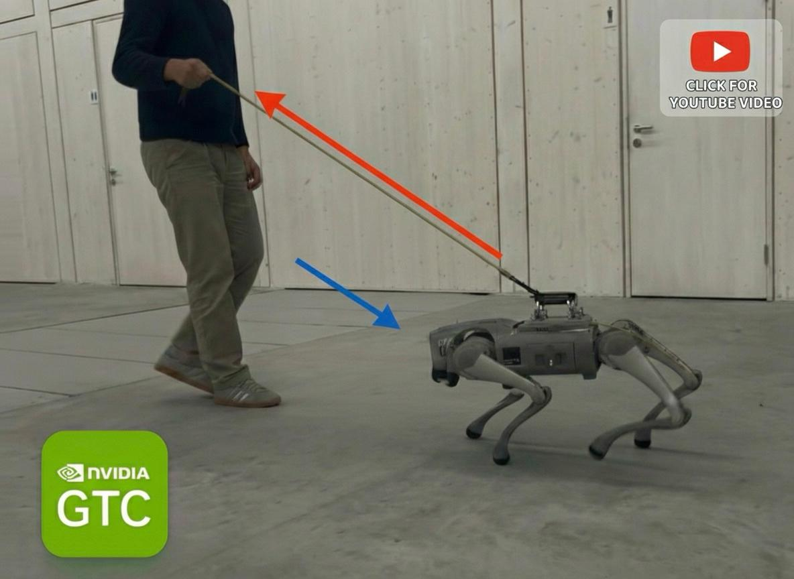

# Go2 RL Lab

**Force-Compliant Quadruped Locomotion with Sim2Real Transfer**

  

A reinforcement learning framework for training and deploying locomotion policies on the Unitree Go2, built on NVIDIA Isaac Lab. This project addresses two critical challenges in legged robotics: bridging the sim-to-real gap through system identification, and achieving compliant robot behavior for safe human-robot interaction.

---

## Force-Compliant Locomotion

Control policies trained with deep RL learn to *reject* external forces to maintain stability. This makes them stiff, aggressive, and unsafe around humans. We train end-to-end policies that instead learn to *yield* to external forces — enabling safe, intuitive human-robot interaction without any force sensors.

  

When pushed, the robot moves compliantly in the force direction instead of fighting back. The response is smooth and controlled — no high-frequency torques, no aggressive rejection. This enables pulling the robot like a dog on a leash, using it as a barrow to carry payload, or simply moving it out of the way safely.

| | Stiff Policy | Compliant Policy |
|---|---|---|
| **Push response** | Aggressive force rejection | Smooth yielding in force direction |
| **Human interaction** | Unsafe, high-frequency torques | Safe, controlled response |
| **Energy efficiency** | High (fighting disturbances) | Lower (working with disturbances) |
| **Recovery** | Abrupt | Gradual, smooth |

---

## Bridging the Sim-to-Real Gap with PACE

Policies trained in simulation often fail on real hardware. Most approaches neglect actuator-specific energy losses or rely on hand-tuned reward formulations. We adapted the [PACE framework](https://arxiv.org/pdf/2509.06342) ([our Go2 adaptation](https://github.com/katari16/pace-sim2real/tree/hans-dev1)) for the Unitree Go2 — a large-scale parallelized system identification approach that finds optimal actuator parameters (armature, viscous friction, friction, encoder bias) from real-world data.

  
  &nbsp;&nbsp;
  

**Left:** Real-world data collection — exciting the robot's joints with chirp signals to capture true actuator dynamics.
**Right:** Large-scale parallelized optimization in Isaac Lab — finding the parameters that best match real-world behavior.

The identified parameters augment the IsaacLab `DCMotorCfg`, producing a simulator that accurately captures the real actuator dynamics and enables zero-shot deployment.

| | Without PACE | With PACE |
|---|---|---|
| **Sim-to-real transfer** | Sluggish, inconsistent motor response | Smooth, reliable zero-shot deployment |
| **Tracking accuracy** | Poor, especially rear legs | Consistent across all joints |
| **Gait quality** | Unstable, jerky | Natural, controlled |

---

## Deployment

The repo includes a Python-first deployment script that supports both **sim2real** (real Unitree Go2 hardware) and **sim2sim** (MuJoCo simulator via [unitree_mujoco](https://github.com/unitreerobotics/unitree_mujoco)) deployment. Control the robot with a joystick or keyboard (WASD + QE for movement, Enter/Space/Esc for FSM transitions). All deployment code lives in `deploy/`.

The data collection script for running PACE system identification can be found at [`deploy/unitree_sdk2_python/example/go2/low_level/go2_pace_data_collection.py`](deploy/unitree_sdk2_python/example/go2/low_level/go2_pace_data_collection.py), alongside the data collected during our experiments.

**Dependencies for deployment:**
- [unitree_mujoco](https://github.com/unitreerobotics/unitree_mujoco) — for sim2sim validation
- [go2_odometry](https://github.com/inria-paris-robotics-lab/go2_odometry) — Kalman filter for state estimation on real hardware

---

## Acknowledgments

- **NVIDIA** — Isaac Sim, Isaac Lab
- **Unitree Robotics** — Go2 platform and SDK
- **PACE Authors** — [Original system identification framework](https://arxiv.org/pdf/2509.06342)

## License

BSD-3-Clause
