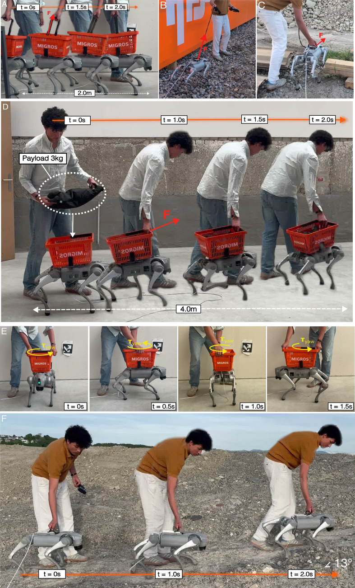
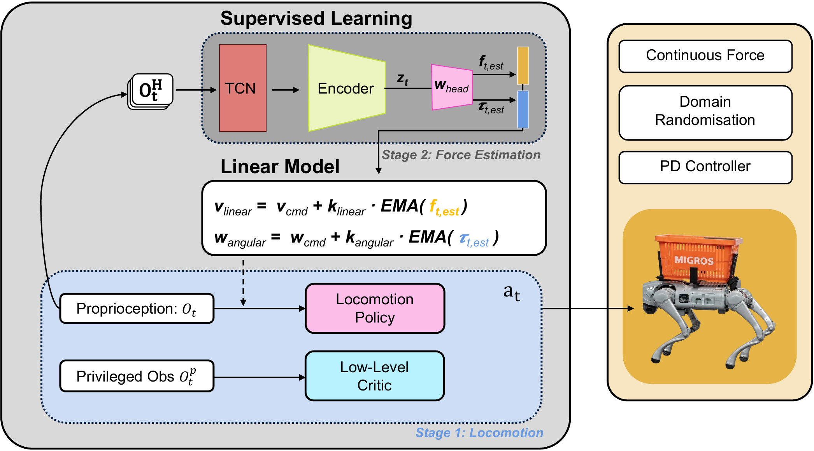
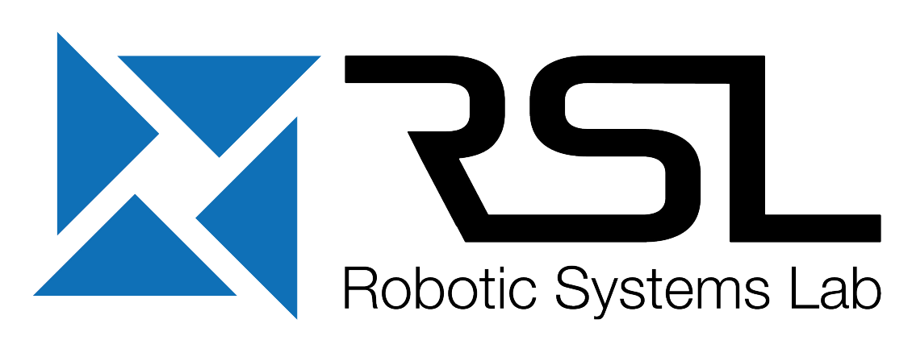

# RoboBarrow: Compliant Force-Based Control for Quadrupedal Robots

**Proprioceptive Force and Wrench Estimation for Compliant Quadrupedal Locomotion**

Bachelor Thesis, Spring Term 2026 — Robotic Systems Lab (RSL), ETH Zurich

*Author:* Hans Baumann-Ortiz | *Supervisors:* Filip Bjelonic, William Talbot | *Lecturer:* Prof. Dr. Marco Hutter

<p align="center">
  
  <br>
  <em>Figure 1.1: Real-world force-compliant locomotion on the Unitree Go2. (A) Guided walking via leash force, (B) outdoor terrain, (C) gravel, (D) payload transport (3 kg), (E) compliance mode switching, (F) slope traversal (13°). All behaviors driven by proprioceptive force estimation without dedicated force sensors.</em>
</p>

## Abstract

Legged robots offer terrain versatility that wheeled platforms cannot match, yet they currently lack the intuitive force-based interaction that makes wheelbarrows and hand carts easy to use. This work combines the agility of a quadruped with the ease of use of a wheeled barrow by enabling compliant force-based control on the Unitree Go2 without dedicated force sensors.

Two contributions are presented. First, an admittance-based compliant control framework for legged locomotion: a proprioceptive force estimator trained concurrently with a velocity tracking policy estimates external forces and torques from joint-level observations, and a model-based admittance controller maps the estimated wrench to velocity command modulations, providing tunable compliance through a single gain constant adjustable at deployment without retraining. Second, an extensive evaluation of the framework in simulation across architectural ablations, domain randomization, and observability conditions, with qualitative validation on the physical Unitree Go2 over unstructured outdoor terrain.

The force estimator achieves 3 N MAE on horizontal forces, 4.1° median directional accuracy, and 0.57 Nm yaw torque MAE in simulation. The deployed system demonstrates compliant navigation of outdoor terrain including gravel, grass, and slopes up to 13°, as well as payload transport of 3 kg through a parkour environment. Together, these results establish a general-purpose recipe for learning compliant force-based control on quadrupedal robots, enabling intuitive human guidance while carrying static payloads across diverse environments.

## Contributions

This work presents two main contributions. First, we develop an admittance-based learning framework for compliant legged locomotion. A velocity tracking locomotion policy is trained in simulation for the Unitree Go2 quadruped and transferred to the real robot for deployment on unstructured outdoor terrain. A proprioceptive force estimator, trained concurrently with the policy, estimates external forces and torques applied to the robot's base from joint-level observations alone. A first-order admittance controller maps the estimated wrench to velocity command modulations, enabling tunable compliance through a single gain constant *k* without retraining.

Second, we present an extensive evaluation of the force estimator and the compliant control framework. The estimator is characterised in simulation across force magnitudes, directions, and temporal profiles. An ablation study across 15 architectural configurations identifies key design choices for proprioceptive force estimation. An observability analysis quantifies the error introduced by domain randomization and establishes the estimation floor imposed by the proprioceptive observation set. The deployed system is validated on the physical robot over gravel, grass, and slopes up to 13°, and during payload transport of 3 kg through a parkour environment.

<p align="center">
  
  <br>
  <em>Figure 4.1: Training pipeline. The force estimator processes a proprioceptive history buffer and outputs a 4D wrench estimate. The compliance module modulates the velocity commands via admittance control. The locomotion policy produces joint position targets tracked by the on-board PD controllers at 50 Hz.</em>
</p>

## Results

Comparison under training-regime and OU (continuously varying) disturbance protocols:

| Metric | Training-regime | OU disturbance |
|---|---|---|
| F_x MAE | 3.00 N | 4.41 N |
| F_y MAE | 2.57 N | 4.00 N |
| F_z MAE | 6.24 N | 8.85 N |
| τ_yaw MAE | 0.57 Nm | 0.98 Nm |
| Angular error (median) | 4.1 deg | 10.4 deg |
| Relative error (force) | 36% | 55% |

Effect of domain randomization and privileged observations (TCN architecture, H=30, 6D output):

| Configuration | Privileged inputs | F_x | F_y | F_z | Force MAE | Ang. |
|---|---|---|---|---|---|---|
| Baseline (deployed) | none | 3.00 | 2.93 | 6.88 | 4.27 | 4.3° |
| No mass randomization | none | 2.35 | 2.67 | 2.22 | 2.41 | 3.8° |
| No randomization | none | 2.28 | 2.50 | 2.99 | 2.59 | 3.3° |
| All privileged | mass, vel., contacts | 1.81 | 2.02 | 2.00 | 1.94 | 2.7° |
| All privileged, no rand. | mass, vel., contacts | 1.82 | 1.76 | 1.92 | 1.83 | 2.6° |
| Velocity only | base lin. vel. | 2.04 | 2.12 | 5.92 | 3.36 | 3.0° |
| Contacts only | foot forces | 3.10 | 3.11 | 7.02 | 4.41 | 4.6° |

The architectural floor with all privileged inputs is 1.83 N force MAE and 2.6° angular error, indicating that approximately half of the deployed horizontal error originates from information unavailable in the proprioceptive stream. Real-world validation on the physical Go2 confirms sim-to-real transfer: the estimator tracks a 20.5 N static pull with a mean bias of −0.3 N across four repeated trials.

## Repository Structure

```
go2_rl_lab/
├── source/go2_rl_lab/go2_rl_lab/
│   ├── estimator/              # Force estimator network + joint training runner
│   ├── tasks/manager_based/go2_rl_lab/
│   │   ├── __init__.py         # Gym task registration (Go2-Est-* IDs)
│   │   ├── go2_lowlevel_env_cfg.py       # Base locomotion environment
│   │   ├── go2_ablation_env_cfgs.py      # Ablation env variants (wrench, randomization, etc.)
│   │   ├── go2_6dctrl_env_cfg.py         # Deployed 6D wrench + pose commands
│   │   ├── go2_payload_env_cfg.py        # Payload transport variant
│   │   ├── mdp/                # Observations, rewards, events, curriculums
│   │   └── agents/             # Runner configs (PPO hyperparams + estimator arch)
│   └── assets/                 # Robot URDF/USD definitions
├── scripts/rsl_rl/             # Training, evaluation, and export scripts
├── deploy/
│   ├── deploy_real/            # Real robot deployment (Unitree SDK2)
│   ├── sim2sim/                # MuJoCo sim-to-sim validation
│   └── pre_train/              # Exported JIT policy + estimator checkpoints
└── docs/                       # Evaluation protocol
```

## Source Code Architecture

A task is defined by pairing an **environment config** (observations, rewards, events, scene) with a **runner config** (PPO hyperparameters, estimator architecture). Both are combined when registering a Gym task ID in `__init__.py`.

### Environment Configs (what the robot sees and experiences)

| File | Purpose |
|---|---|
| `go2_lowlevel_env_cfg.py` | **Base environment.** Defines the locomotion policy obs (60-dim), critic obs (70-dim), PD gains, terrain, reward terms. All other env configs inherit from this. |
| `go2_ablation_env_cfgs.py` | **Ablation variants.** Forks the base env to vary: wrench dimensionality (3D→6D), force profiles (constant, trapezoid, OU), domain randomization (mass, noise), privileged observations (velocity, contacts), compliance rewards, PD gains. |
| `go2_6dctrl_env_cfg.py` | **Deployed configuration.** Extends P-series wrench env with 6-DOF pose commands (roll, pitch, height) and tuned reward weights. This is the env behind `Go2-Est-Deploy-v0`. |
| `go2_payload_env_cfg.py` | **Payload transport.** Adds a 3 kg payload body and randomized mass (1–3 kg). |

### Runner Configs (how the policy and estimator are trained)

| File | Purpose |
|---|---|
| `agents/rsl_rl_lowlevel_cfg.py` | **Base runner.** Defines `LowLevelRunnerCfg`: PPO actor/critic architecture [512,256,128], estimator architecture (TCN encoder, force head, reconstruction decoder), 3-phase training gates, compliance parameters. Also defines `LowLevelNoEstRunnerCfg` for training without an estimator. |
| `agents/rsl_rl_ablation_cfg.py` | **Ablation runner variants.** Overrides estimator hyperparameters (history length, hidden dims, force_dim, TCN toggle, loss weights) for each ablation. Each class inherits from `LowLevelRunnerCfg` and changes only the relevant parameters. |

### Force Estimator (the learned wrench predictor)

| File | Purpose |
|---|---|
| `estimator/force_estimator.py` | TCN-based network: temporal conv preprocessor → MLP encoder [128,64] → force head [32,16] → N-dim wrench. Optional reconstruction decoder for auxiliary loss. |
| `estimator/obs_history_buffer.py` | Sliding window buffer collecting H timesteps × 57 proprioceptive dims. Fed to the estimator each step. |
| `estimator/compliant_on_policy_runner.py` | Joint training runner. Extends RSL-RL's `OnPolicyRunner` with: (1) force estimator training via supervised loss against GT, (2) 3-phase curriculum (walking → forces → linear mapping), (3) admittance compliance module. |

### MDP Components (observations, rewards, events)

All in `tasks/manager_based/go2_rl_lab/mdp/`:

| File | Purpose |
|---|---|
| `observations.py` | Observation terms: joint states, angular velocity, gravity, applied torques, force estimate, privileged terms (GT force, base velocity, contacts) |
| `rewards.py` | Reward terms: velocity tracking, standing pose, smoothness, action rate, foot contact penalties |
| `events.py` | Force application: persistent XYZ/wrench forces, trapezoid profiles, randomization events (mass, friction, push) |
| `curriculums.py` | Standard curriculum terms (terrain difficulty, command ranges) |
| `force_magnitude_curriculum.py` | Force magnitude scheduling (hard gate, linear ramp, bucketed) |
| `temporal_stage_curriculum.py` | 3-phase training stage management |

## Task Configurations

All tasks follow the pattern `Go2-Est-<Axis>-<Variant>-v0` and are registered in `__init__.py`. Each task pairs an env config with a runner config.

| Task ID | Description |
|---|---|
| `Go2-Est-Deploy-v0` | Deployed configuration: 6D wrench, TCN, H=30, big net |
| `Go2-Est-Payload-v0` | Payload transport (1–3 kg randomized mass) |
| `Go2-LowLevel-v0` | Base locomotion + 3D force estimation |
| `Go2-LowLevel-NoEst-v0` | Base locomotion without force estimator |

29 ablation tasks cover: history length, TCN preprocessor, network capacity, reconstruction loss, wrench dimensionality, PD gains, domain randomization, force curriculum, and privileged observations. See **[docs/ablations.md](docs/ablations.md)** for the full listing with parameter details.

## Training

```bash
python scripts/rsl_rl/train.py --task Go2-Est-Deploy-v0 --num_envs 4096 --max_iterations 10000
```

## Evaluation

Three evaluation protocols are implemented:

| Script | Protocol | Description |
|--------|----------|-------------|
| `scripts/rsl_rl/static_eval.py` | Constant force | 12 envs, persistent forces, time-series data |
| `scripts/rsl_rl/eval/ou_force_eval.py` | OU disturbance | Continuously varying forces via Ornstein-Uhlenbeck |
| `scripts/rsl_rl/eval/rollout_estimator_eval.py` | Training-regime | 4096 envs, 20 s, piecewise-constant forces |

A unified script runs all three protocols for any configuration:

```bash
./scripts/rsl_rl/run_eval.sh --task Go2-Est-DomRand-Full-v0 --checkpoint <path_to_model.pt>

./scripts/rsl_rl/run_eval.sh --group architecture
./scripts/rsl_rl/run_eval.sh --group randomization
./scripts/rsl_rl/run_eval.sh --group curriculum
./scripts/rsl_rl/run_eval.sh --group observability
./scripts/rsl_rl/run_eval.sh --group deployed
```

## Pretrained Policies

Exported JIT checkpoints (policy.pt + estimator.pt):

```
deploy/pre_train/
├── ablation_6dctrl_total50/    # Deployed configuration (Go2-Est-Deploy-v0)
├── ablation_p1/ ... p6/        # History length and network capacity
├── ablation_j3/, ablation_j5/  # TCN preprocessor variants
├── ablation_p18/               # Payload transport
└── payload_3kg/                # Payload (standalone export)
```

## Sim-to-Sim Deployment (MuJoCo)

Validate trained policies in MuJoCo before hardware deployment:

```bash
python deploy/sim2sim/sim2sim_compliant_no_foot_xyz.py
```

Supports joystick control and UDP-based force application for testing.

## Real Robot Deployment

Deploy on the physical Unitree Go2 via the Unitree SDK2:

```bash
python deploy/deploy_real/deploy_6dctrl.py <network_interface> go2_ablation_6dctrl_total50.yaml
```

Configuration files in `deploy/deploy_real/configs/` specify the policy path, estimator path, observation dimensions, and compliance gain.

## Dependencies

- NVIDIA Isaac Lab (Isaac Sim 4.x)
- RSL-RL (PPO implementation)
- PyTorch
- MuJoCo (for sim2sim)
- Unitree SDK2 Python (for real deployment)

---

<p align="center">
  <a href="https://www.ethrobotics.ch/"></a>
  &nbsp;&nbsp;&nbsp;&nbsp;
  <a href="https://rsl.ethz.ch/"></a>
  &nbsp;&nbsp;&nbsp;&nbsp;
  <a href="https://nunu.ai/"></a>
</p>

<p align="center">
  <sub>Thanks to the <a href="https://www.ethrobotics.ch/">ETH Robotics Club</a>, <a href="https://rsl.ethz.ch/">Robotic Systems Lab</a>, and <a href="https://nunu.ai/">Nunu AI</a></sub>
  <br>
  <sub>With special thanks to Elia Huber, Sébastien Steininger, and Declan Shine</sub>
</p>

<p align="center">
  <sub>💚 This project was selected as a winner of the NVIDIA Golden Ticket Award</sub>
</p>
