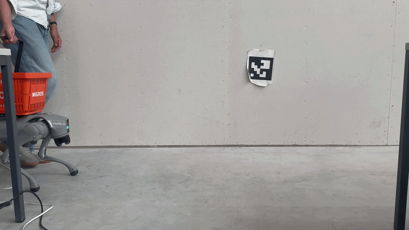
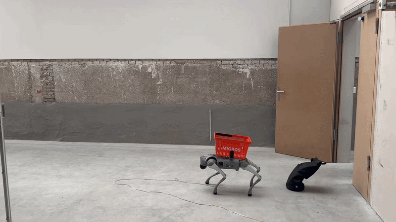
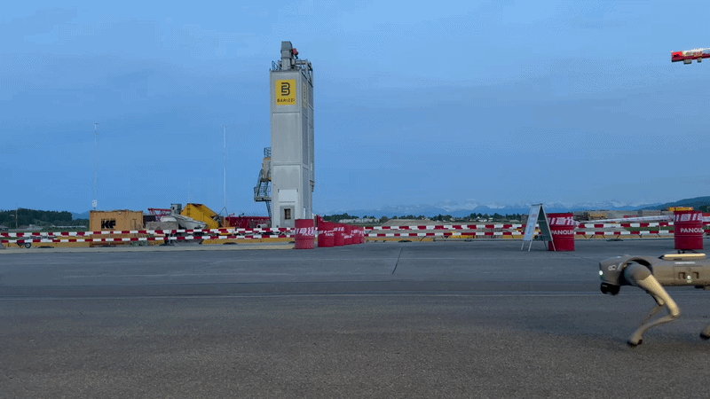

# RoboBarrow: Compliant Force-Based Control for Quadrupedal Robots

**Proprioceptive Force and Wrench Estimation for Compliant Quadrupedal Locomotion**

Bachelor Thesis, Spring Term 2026 — Robotic Systems Lab (RSL), ETH Zurich

*Author:* Hans Baumann-Ortiz | *Supervisors:* Filip Bjelonic, William Talbot | *Lecturer:* Prof. Dr. Marco Hutter

<table align="center">
  <tr>
    <td align="center"><br><sub>Force-compliant walking</sub></td>
    <td align="center"><br><sub>Construction site deployment</sub></td>
  </tr>
  <tr>
    <td align="center"><br><sub>Sim: admittance compliance</sub></td>
    <td align="center"><br><sub>3 kg payload transport</sub></td>
  </tr>
</table>

<p align="center">
  
  <br>
  <em>Figure 1.1: Demonstration of force-compliant control on the Unitree Go2. (A) Linear compliance: pulling the robot along a 2.0 m trajectory. (B) Deployment on gravel terrain at a construction site. (C) Force-guided navigation through a narrow environment. (D) Payload transport: pushing the robot while carrying a 3 kg payload over 4.0 m. (E) Yaw torque compliance: steering the robot's heading through sustained applied torques. (F) Force-guided locomotion on a rugged 13° slope at a construction site.</em>
</p>

## Motivation

Legged robots can traverse terrain that wheeled platforms cannot — but they lack the intuitive force-based interaction that makes wheelbarrows and hand carts trivial to operate. RoboBarrow bridges this gap: a human pushes or pulls the robot, and it yields compliantly, no force sensor required.

## Key Contributions

1. **Proprioceptive force estimation** — A TCN-based network estimates 6D wrenches (forces + torques) from joint-level observations alone, trained jointly with the locomotion policy.

2. **Admittance compliance** — A single gain constant *k* maps estimated forces to velocity modulations. Tunable at deployment without retraining.

3. **Extensive ablation study** — 29 configurations across history length, network architecture, wrench dimensionality, domain randomization, and observability. The estimator achieves 3 N MAE (horizontal), 4.1° angular accuracy, and 0.57 Nm yaw MAE.

4. **Real-world validation** — Deployed on the Unitree Go2 over gravel, grass, slopes (13°), and with 3 kg payload through a parkour environment.

<p align="center">
  
  <br>
  <em>Figure 4.1: Training pipeline. The force estimator processes a proprioceptive history buffer and outputs a 4D wrench estimate. The compliance module modulates the velocity commands via admittance control. The locomotion policy produces joint position targets tracked by the on-board PD controllers at 50 Hz.</em>
</p>

## Results

| Metric | Training-regime | OU disturbance |
|---|---|---|
| F_x MAE | 3.00 N | 4.41 N |
| F_y MAE | 2.57 N | 4.00 N |
| F_z MAE | 6.24 N | 8.85 N |
| τ_yaw MAE | 0.57 Nm | 0.98 Nm |
| Angular error (median) | 4.1 deg | 10.4 deg |
| Relative error (force) | 36% | 55% |

Effect of domain randomization and privileged observations (TCN architecture, H=30, 6D output):

| Configuration | Privileged inputs | F_x | F_y | F_z | Force MAE | Ang. |
|---|---|---|---|---|---|---|
| Baseline (deployed) | none | 3.00 | 2.93 | 6.88 | 4.27 | 4.3° |
| No mass randomization | none | 2.35 | 2.67 | 2.22 | 2.41 | 3.8° |
| No randomization | none | 2.28 | 2.50 | 2.99 | 2.59 | 3.3° |
| All privileged | mass, vel., contacts | 1.81 | 2.02 | 2.00 | 1.94 | 2.7° |
| All privileged, no rand. | mass, vel., contacts | 1.82 | 1.76 | 1.92 | 1.83 | 2.6° |
| Velocity only | base lin. vel. | 2.04 | 2.12 | 5.92 | 3.36 | 3.0° |
| Contacts only | foot forces | 3.10 | 3.11 | 7.02 | 4.41 | 4.6° |

The estimation floor with all privileged inputs is 1.83 N / 2.6°, indicating ~50% of deployed error comes from information absent in the proprioceptive stream.

## Repository Structure

```
go2_rl_lab/
├── source/go2_rl_lab/go2_rl_lab/
│   ├── estimator/              # Force estimator network + joint training runner
│   ├── tasks/manager_based/go2_rl_lab/
│   │   ├── __init__.py         # Gym task registration (Go2-Est-* IDs)
│   │   ├── go2_lowlevel_env_cfg.py       # Base locomotion environment
│   │   ├── go2_ablation_env_cfgs.py      # Ablation env variants (wrench, randomization, etc.)
│   │   ├── go2_6dctrl_env_cfg.py         # Deployed 6D wrench + pose commands
│   │   ├── go2_payload_env_cfg.py        # Payload transport variant
│   │   ├── mdp/                # Observations, rewards, events, curriculums
│   │   └── agents/             # Runner configs (PPO hyperparams + estimator arch)
│   └── assets/                 # Robot URDF/USD definitions
├── scripts/rsl_rl/             # Training, evaluation, and export scripts
├── deploy/
│   ├── deploy_real/            # Real robot deployment (Unitree SDK2)
│   ├── sim2sim/                # MuJoCo sim-to-sim validation
│   └── pre_train/              # Exported JIT policy + estimator checkpoints
└── docs/                       # Ablation docs, logos
```

## Source Code Architecture

A task pairs an **environment config** (observations, rewards, events, scene) with a **runner config** (PPO hyperparameters, estimator architecture), registered as a Gym task ID in `__init__.py`.

### Environment Configs

| File | Purpose |
|---|---|
| `go2_lowlevel_env_cfg.py` | **Base environment.** Policy obs (60-dim), critic obs (70-dim), PD gains, terrain, rewards. All others inherit from this. |
| `go2_ablation_env_cfgs.py` | **Ablation variants.** Wrench dimensionality, force profiles, domain randomization, privileged obs, PD gains. |
| `go2_6dctrl_env_cfg.py` | **Deployed config.** 6-DOF pose commands + tuned rewards. Behind `Go2-Est-Deploy-v0`. |
| `go2_payload_env_cfg.py` | **Payload transport.** 3 kg body, randomized 1–3 kg mass. |

### Runner Configs

| File | Purpose |
|---|---|
| `agents/rsl_rl_lowlevel_cfg.py` | **Base runner.** PPO [512,256,128], estimator arch (TCN + force head + decoder), 3-phase gates. |
| `agents/rsl_rl_ablation_cfg.py` | **Ablation variants.** Overrides history length, hidden dims, force_dim, TCN, loss weights. |

### Force Estimator

| File | Purpose |
|---|---|
| `estimator/force_estimator.py` | TCN → MLP encoder → force head → N-dim wrench + optional reconstruction decoder. |
| `estimator/obs_history_buffer.py` | Sliding window: H timesteps × 57 proprioceptive dims. |
| `estimator/compliant_on_policy_runner.py` | Joint PPO + estimator training with 3-phase curriculum and admittance compliance. |

## Task Configurations

| Task ID | Description |
|---|---|
| `Go2-Est-Deploy-v0` | Deployed: 6D wrench, TCN, H=30, big net |
| `Go2-Est-Payload-v0` | Payload transport (1–3 kg) |
| `Go2-LowLevel-v0` | Base locomotion + 3D force estimation |
| `Go2-LowLevel-NoEst-v0` | Base locomotion, no estimator |

29 ablation tasks covering history length, TCN, network capacity, reconstruction loss, wrench dimensionality, PD gains, domain randomization, force curriculum, and privileged observations. See **[docs/ablations.md](docs/ablations.md)** for details.

## Training

```bash
python scripts/rsl_rl/train.py --task Go2-Est-Deploy-v0 --num_envs 4096 --max_iterations 10000
```

## Evaluation

| Script | Protocol |
|---|---|
| `scripts/rsl_rl/static_eval.py` | Constant force (12 envs, time-series) |
| `scripts/rsl_rl/eval/ou_force_eval.py` | OU disturbance (continuously varying) |
| `scripts/rsl_rl/eval/rollout_estimator_eval.py` | Training-regime (4096 envs, 20 s) |

```bash
./scripts/rsl_rl/run_eval.sh --task Go2-Est-Deploy-v0 --checkpoint <path_to_model.pt>
./scripts/rsl_rl/run_eval.sh --group architecture
```

## Deployment

**Sim-to-Sim (MuJoCo):**
```bash
python deploy/sim2sim/sim2sim_compliant_no_foot_xyz.py
```

**Real Robot (Unitree SDK2):**
```bash
python deploy/deploy_real/deploy_6dctrl.py <network_interface> go2_ablation_6dctrl_total50.yaml
```

## Dependencies

- NVIDIA Isaac Lab (Isaac Sim 4.x)
- RSL-RL (PPO implementation)
- PyTorch
- MuJoCo (for sim2sim)
- Unitree SDK2 Python (for real deployment)

---

<p align="center">
  
</p>

---

<p align="center">
  <a href="https://www.ethrobotics.ch/"></a>
  &nbsp;&nbsp;&nbsp;&nbsp;
  <a href="https://rsl.ethz.ch/"></a>
  &nbsp;&nbsp;&nbsp;&nbsp;
  <a href="https://nunu.ai/"></a>
</p>

<p align="center">
  <sub>Thanks to the <a href="https://www.ethrobotics.ch/">ETH Robotics Club</a>, <a href="https://rsl.ethz.ch/">Robotic Systems Lab</a>, and <a href="https://nunu.ai/">Nunu AI</a></sub>
  <br>
  <sub>With special thanks to Elia Huber, Sébastien Steininger, and Declan Shine</sub>
</p>

<p align="center">
  <sub>💚 This project was selected as a winner of the NVIDIA Golden Ticket Award</sub>
</p>
